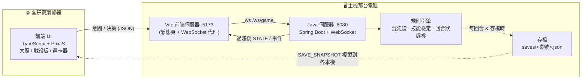
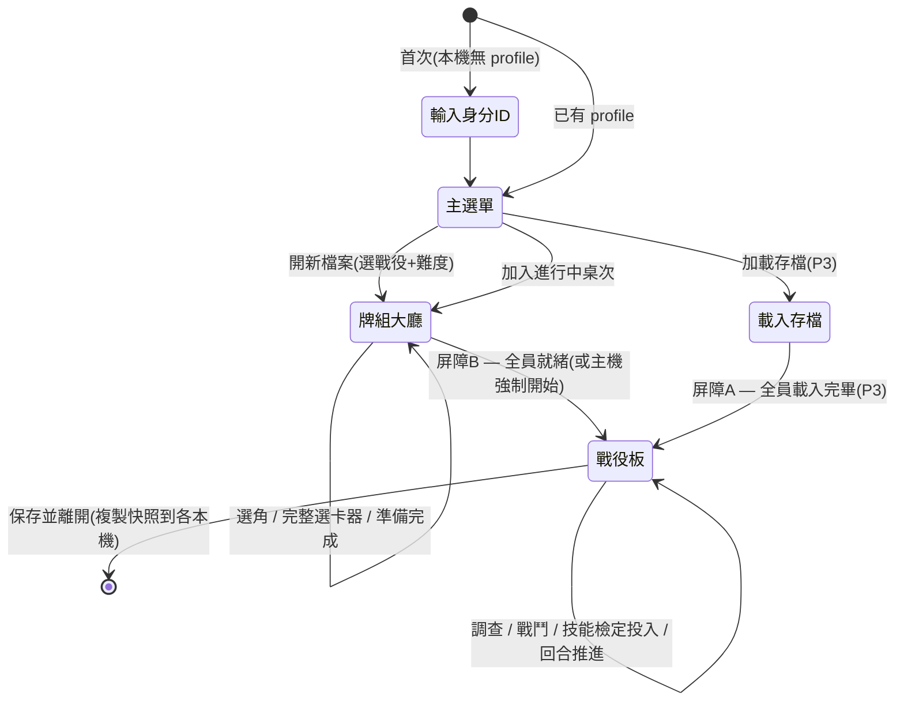
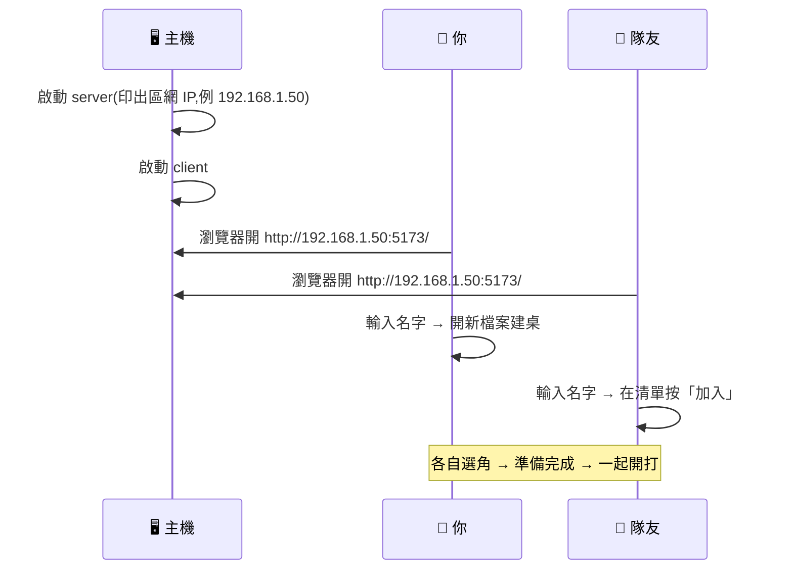
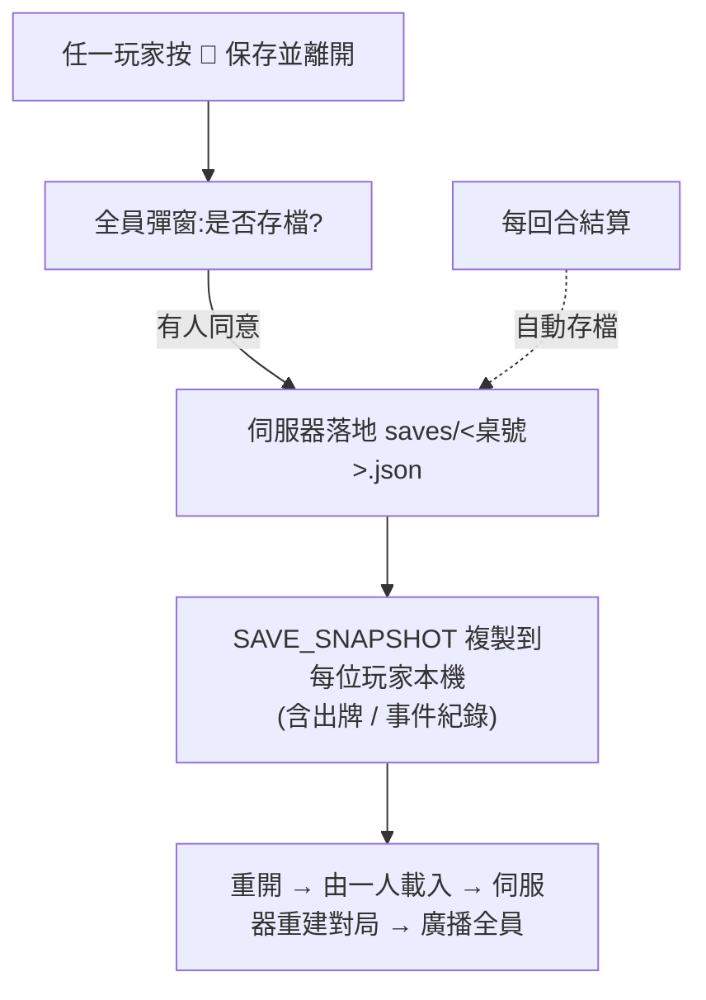

# 00 · 系統與啟動總覽

> 這份是「**玩法以外**」的視覺化總覽:遊戲是什麼、怎麼組成、怎麼連線、怎麼啟動、怎麼存檔。
> 玩法規則見 [遊戲規則書](10-rulebook-zh.md);逐條引擎規格見 [05](05-rules-engine-spec.md)。

---

## 🎴 這是什麼

**Arkham Horror: The Card Game** 的電子化版本 —— 1–4 人**合作**、**區域網路**同樂、**戰役存檔驅動**。
權威伺服器跑規則引擎;每位玩家用瀏覽器連進來,看到自己的過濾視圖、送出「意圖」,由伺服器裁決。

```
        🧑 玩家A ┐
        🧑 玩家B ┼──(同一區網 Wi-Fi)──▶  🖥️ 主機(誰跑誰是主機)
        🧑 玩家C ┘                          ├─ 前端 :5173(瀏覽器介面)
                                            └─ 伺服器 :8080(Java 規則引擎 · 唯一真相)
```

---

## 🏛️ 系統架構



**權威伺服器**:所有規則判定在伺服器;客戶端只送意圖、只畫伺服器下發的狀態。隱藏資訊(遭遇牌堆順序、他人手牌、混沌袋抽取)不外洩;混沌袋用**可設種子的伺服器端 RNG**,支援重播。

---

## 🧰 技術堆疊

| 層 | 技術 | 說明 |
|---|---|---|
| 規則引擎 | **Java 21**(records / sealed / pattern switch) | 純邏輯、無框架;可獨立測試 |
| 伺服器 | **Spring Boot 3.3** + WebSocket | 單一端點 `/ws/game`;每桌一個 session |
| 前端 | **TypeScript + Vite + PixiJS v8** | 大廳(DOM)+ 戰役板(Canvas)+ 選卡器(iframe) |
| 桌面殼(選用) | **Tauri v2** | 讀本機卡圖資料夾(繞過瀏覽器沙箱) |
| 協定 | WebSocket JSON | 唯一契約 [`protocol/`](../protocol/protocol.md) |
| 建置 | Gradle(foojay 自動抓 JDK 21)+ npm | 首次會自動下載工具鏈 |
| 測試 | JUnit 5 + Node e2e(`e2e/`) | 兩客戶端跑完整協定 |

---

## 🧭 進入遊戲:存檔驅動大廳(取代 room)

**不用打房號**。連進主機後,從「進行中桌次 / 本機存檔」點同一桌就湊在一起。三種身分別搞混:

| 身分 | 是什麼 | 存哪 |
|---|---|---|
| 🆔 **playerId** | 「人」的永久識別(首次輸入名稱,可改名) | 各玩家本機 |
| 🕵️ **investigator** | 某存檔裡你選的角色 | 存檔名冊內 |
| 💾 **campaign save** | 一條戰役 + 名冊 + 進度 + 快照 | 主機 + 複製到各本機 |



> **屏障(barrier)= 交握**:大家都按「準備完成」才開打;載入時大家都載完才啟用。主機有「強制開始」。詳見 [docs/09](09-lobby-save-handshake.md)。

---

## 🚀 怎麼啟動

> 前置:**主機那台**要有 JDK(理想 21;較舊版 Gradle 會自動抓)+ Node 18+。首次啟動會下載工具鏈,需要網路;之後可離線區網玩。

### 最省事:主機一台跑兩個,其他人只要瀏覽器

| 平台 | 伺服器 | 前端 | 一鍵兩者 |
|---|---|---|---|
| 🪟 **Windows** | 雙擊 `start-server.bat` | 雙擊 `start-client.bat` | 雙擊 `run-dev.bat` |
| 🍎 **macOS** | 雙擊 `start-server.command` | 雙擊 `start-client.command` | 雙擊 `run-dev.command` |
| 🐧 終端機 | `./start-server.sh` | `./start-client.sh` | `./run-dev.sh` |



- 首次啟動 Windows 防火牆跳出 → 勾**私人網路**允許(放行 8080 / 5173)。
- 連別台主機:`start-client.sh 192.168.1.50`(macOS/Linux)或 `start-client.bat 192.168.1.50`(Windows)。
- 完整說明見 [docs/07 LAN 連線](07-lan-setup.md)。

### ✅ 自我測試(不用真人也能驗)
- 🪟 `e2e.bat`　🍎 `e2e.command`　🐧 `./e2e.sh`(或 `node e2e/run.mjs`)
- 會自動起暫時伺服器 → 兩客戶端跑完整協定(大廳 / 開打 / 存檔續玩)→ 前端建置 → 收尾。全過離開碼 0。

---

## 💾 存檔 / 續玩



- 存檔複製到**每位玩家本機** → 主機可輪流,誰有最新存檔誰就能開桌載入(無單點)。
- 詳見 [docs/08 存檔與朔源](08-save-and-provenance.md)、[docs/09 §7](09-lobby-save-handshake.md)。

---

## 🗂️ 專案結構

```
arkham/
├── engine/        Java 規則引擎(混沌袋 / 技能檢定 / 場景 / 事件)
├── server/        Spring Boot WebSocket 伺服器(大廳 + 對局 session)
├── client/        前端(TS + PixiJS);public/deckbuilder.html = 內嵌選卡器
├── protocol/      連線協定唯一契約(messages.ts + protocol.md)
├── content/       卡片資料工具與參考(ArkhamDB 轉換 / 藝術資料 / 繁中語系範本)
├── prototype/     單機原型(戰役板 index.html + 選卡器 deckbuilder.html)
├── src-tauri/     Tauri 桌面殼(讀本機卡圖)
├── rulebook/      官方規則書 PDF(修訂核心盒)
├── e2e/           端到端測試(run.mjs 協調器 + 三條協定測試)
├── docs/          設計文件(本檔 00 + 01–09)
└── *.bat / *.command / *.sh   跨平台啟動 / 測試腳本
```

---

## 📌 目前實作進度(高層)

| 模組 | 狀態 |
|---|---|
| 規則引擎 lite(移動/調查/戰鬥/閃避/交戰/技能檢定/回合/神話) | ✅ 可玩 |
| 大廳(身分 / 建桌 / 加入 / 名冊) | ✅ P1 |
| 牌組大廳 → 屏障 → 開打 + 完整選卡器整合 | ✅ P2 |
| 存檔 / 續玩(場內) | ✅ |
| 加載存檔屏障 A / 動態名冊(中離·亂入·接手) / 死亡換角投票 | ⏳ P3–P5(見 [docs/09 §15](09-lobby-save-handshake.md)) |
| 完整能力時機系統 / 全卡實作 / 戰役劇情 | ⏳ 後續 |

> e2e 全綠:大廳 14 · 牌組大廳→開打 13 · 遊戲流程 32 + 前端建置。
