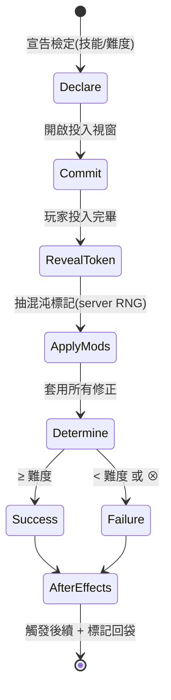

# 02 · 系統設計書

本文涵蓋:功能盤點(功能地圖)、系統架構、**規則引擎設計**(核心)、資料模型、卡牌腳本化方案。

---

## 1. 功能盤點(Feature Map)

以「MVP → 商業版」分層。標 ★ 為 MVP 必要,☆ 為商業/後期。

### A. 帳號與內容(Account & Content)
- ☆ 帳號註冊/登入(Email/OAuth)、個人檔案
- ☆ **擁有內容(Entitlement)**:玩家購買/擁有的卡盒,決定可用卡池與可玩劇本(防盜版核心)
- ☆ 商店與金流、內容包購買
- ★ **內容資料庫**:卡表、劇本、圖像的載入與版本管理

### B. 牌組(Deck)
- ★ **牌組構築器**:依調查員的構築規則篩選、加卡、驗證(張數/等級/職業/招牌/弱點)
- ★ 與擁有內容連動(只能放你擁有的卡)
- ☆ 牌組雲端儲存、分享、匯入/匯出(相容 ArkhamDB 格式可加分)
- ☆ XP 升級介面(戰役中買高等卡、換卡)

### C. 大廳與連線(Lobby & Networking)
- ★ **建立房間 / 加入房間**(LAN:輸入主機 IP;之後雲端:房號/邀請)
- ★ 選調查員、選牌組、選難度、選劇本/戰役
- ☆ 配對(Matchmaking)、好友、重連(reconnect)
- ★ **房內文字聊天 / 標記**(合作遊戲需要溝通)

### D. 對局內(In-Game)——規則引擎驅動
- ★ 完整回合流程(神話/調查/敵人/整備四階段)
- ★ 所有行動(移動/調查/戰鬥/閃避/打牌/啟動/交涉…)+ 合法性提示
- ★ **技能檢定 + 混沌袋**(投入卡、抽標記、結算、封印/返還)
- ★ 敵人行為(獵人尋路、攻擊、關鍵字)
- ★ **卡牌效果自動結算 + 觸發能力視窗 + 決策請求**
- ★ 傷害/恐懼/線索/毀滅/資源等標記管理
- ★ 被擊敗、幕/密謀推進、劇本勝負判定
- ★ **動作記錄(Game Log)/ 可回溯(undo 至少限本地未定案操作)**
- ☆ 動畫、音效、卡牌放大檢視、拖放操作

### E. 戰役(Campaign)
- ★(全內容必需)劇本間銜接、**戰役日誌**、XP 結算、創傷、結局分支
- ★ **戰役存檔 / 續玩**(多人共享一場戰役)

### F. 平台與維運(Platform)
- ☆ 內容更新/熱修(不需重裝即可上新卡)
- ☆ 遙測/分析、當機回報
- ☆ 多語系(AHLCG 有官方繁中,i18n 必要)
- ☆ 客服、封鎖/檢舉、成就、教學關卡

> **功能地圖總結:** 這不是「一個 App」,而是**四個子系統**:①後端服務群(帳號/內容/牌組/戰役)、②大廳/連線、③**規則引擎(權威伺服器)**、④客戶端(UI)。其中 ③ 是技術心臟。

---

## 2. 系統架構(High-Level Architecture)

採 **權威伺服器(Authoritative Server)** 模型——這是規則引擎類遊戲的唯一安全解:客戶端只送「意圖」,伺服器驗證、結算、廣播結果。

```mermaid
flowchart TB
  subgraph Client["客戶端 (Client) — 可 Java/其他"]
    UI["UI 呈現層<br/>(渲染/互動/動畫)"]
    NetC["連線層<br/>(WebSocket)"]
    UI <--> NetC
  end

  subgraph GameServer["遊戲伺服器 (Game Server) — Java"]
    NetS["連線/會話層"]
    Engine["**規則引擎 (headless)**<br/>狀態機・效果・時機・混沌袋"]
    View["每客戶端視圖過濾<br/>(隱藏資訊)"]
    NetS <--> Engine
    Engine --> View --> NetS
  end

  subgraph Backend["後端服務 (Backend) — Java/Spring Boot"]
    Acct["帳號/授權"]
    Content["內容/卡表派送"]
    Deck["牌組服務"]
    Camp["戰役存檔服務"]
  end

  subgraph Stores["資料儲存"]
    PG[("PostgreSQL<br/>帳號/擁有/牌組/戰役")]
    Redis[("Redis<br/>會話/配對/對局快取")]
    OSS[("物件儲存/CDN<br/>卡牌圖像")]
  end

  NetC -- "意圖/選擇 (LAN 或雲端)" --> NetS
  NetS -- "狀態差異/事件" --> NetC
  Client -.-> Acct & Content & Deck & Camp
  Acct --> PG
  Deck --> PG
  Camp --> PG
  Content --> OSS
  GameServer --> Redis
```



### LAN vs 雲端的同一套架構
- **LAN MVP**:某位玩家的機器同時跑「Game Server」,其他人以 LAN IP 連入;後端服務可**內嵌精簡版**或省略(帳號用本機、內容隨客戶端打包)。
- **商業雲端**:同一套 Game Server 搬上雲,加上獨立後端服務群與資料庫。**因為引擎與 UI、與儲存都解耦,搬遷成本低。**

> **設計鐵則:** 規則引擎必須 **headless(無 UI 依賴)+ 確定性(deterministic)**,能被伺服器驅動、也能被自動測試單獨執行。所有隨機(混沌袋、洗牌)集中在一個 **seedable RNG 服務**,以支援存檔重播與除錯。

---

## 3. 規則引擎設計(核心)

規則引擎是本專案 70% 的技術難度所在。以下是其內部結構。

### 3.1 核心物件模型
```
GameState (可序列化)
├── players[]         // 每位:調查員實體、牌組/手牌/棄牌/檯面、資源、行動數、創傷
├── locations[]       // 地圖(圖結構)、線索、遮蔽
├── enemies[]         // 場上敵人及交戰關係
├── encounterDeck     // 遭遇牌堆(隱藏順序,server 專有)
├── actDeck/agendaDeck
├── chaosBag          // 混沌標記多重集合
├── phase/step        // 目前階段/步驟
├── pendingChoice?    // 目前等待哪個玩家做什麼選擇
├── effectStack       // 待結算效果堆疊
└── rngState          // 可重播的亂數狀態

CardInstance
├── definition: CardDefinition   // 靜態(見 §5 資料模型)
├── zone, controller, owner
├── tokens{ damage, horror, clue, doom, charge... }
├── exhausted, flipped
├── attachments[], modifiers[]   // 附屬卡、當前修正
└── scriptRefs                   // 綁定的效果腳本(見 §4)
```

### 3.2 事件匯流排與時機系統
每個遊戲動作都包成事件,並發布 **pre/post** 兩段,讓觸發能力有機會反應:

```
執行動作(如「調查」)
  → 發布 WillInvestigate (pre-window: 可觸發反應)
  → 進行技能檢定子流程 (見 3.3)
  → 依結果改變狀態(取得線索)
  → 發布 DidInvestigate (post-window: 可觸發反應)
  → 檢查強制能力、狀態基準動作(state-based)
```

- **能力視窗(Ability Window)**:引擎在固定節點暫停,依玩家順序詢問是否使用反應能力 → 需要「**引擎暫停 + 向對應客戶端請求決策 + 等待回應**」的協定(見 3.4)。
- **效果堆疊(Effect Stack)**:一個效果觸發另一個時,後進先出結算;需明確排序規則。
- **修正層(Modifier Layers)**:常駐修正的計算順序(基礎→加減→設定值→上下限);參考 MtG 的 layer system 但 AHLCG 較簡單。
- **狀態基準動作(State-Based Actions)**:每次結算後檢查「生命歸零→擊敗」「線索達標→可推進幕」等。

### 3.3 技能檢定子狀態機(範例)

每個轉換點都可能被卡牌能力介入(如「檢定前 +2」「抽到骷髏改抽」「檢定失敗改為成功」)。

### 3.4 決策請求協定(Choice Protocol)
規則引擎是「伺服器主導」的:當需要玩家做決定,引擎產生一個 `ChoiceRequest`(誰、可選項、時限),暫停並經由連線層送給該客戶端;客戶端回 `ChoiceResponse`;引擎驗證後續行。**所有合法性在伺服器判定**,客戶端的「可點/不可點」只是體驗提示。

### 3.5 隱藏資訊處理(重要)
- 遭遇牌堆順序、混沌袋抽取、其他玩家手牌(視設計)= 伺服器專有。
- 伺服器為**每個客戶端產生過濾後的視圖(View)**:只送該玩家該看到的資訊。→ 防作弊、防洩露牌堆順序。

> **🔧 原型優先:** §3.2–3.4(事件/時機/決策協定)是最高風險,建議**第一個 spike 就做這套骨架 + 3~5 張有代表性的卡**(一張常駐、一張反應、一張改檢定、一張召喚敵人、一張多目標選擇),驗證抽象是否撐得住,再談規模化。

---

## 4. 卡牌效果的實作策略(全內容的關鍵)

要支援「全部已發行內容(數千張卡)」,不能每張卡都硬寫死。建議 **三層混合**:

| 層級 | 作法 | 覆蓋率 | 代表卡 |
|---|---|---|---|
| **L1 資料驅動(Data-driven)** | 常見效果用結構化參數描述(如「造成 N 傷害」「+X 某技能」「抽 N 張」),引擎讀資料執行 | 多數普通卡 | 大量基礎支援/事件 |
| **L2 效果 DSL / 積木組合** | 用一套「效果積木(EffectBlock)」的組合式語法拼裝中等複雜卡(條件、選擇、迴圈) | 中等複雜卡 | 附條件、多步驟卡 |
| **L3 腳本化(Scripted)** | 真正刁鑽的卡直接寫程式(Java 類別或嵌入式腳本 Groovy/Kotlin/JS) | 少數例外卡 | 改寫規則的怪卡 |

- 業界前例:**XMage** 幾乎每張卡一個 Java 類別(L3 為主);**Forge** 大量用資料/腳本描述(偏 L1/L2)。AHLCG 卡池比 MtG 小很多,**L1+L2 為主、L3 兜底** 是務實解。
- 需要一個 **卡牌效果註冊表 / 工廠**:由 CardDefinition 的效果描述,產生綁定到 CardInstance 的可執行效果物件。
- **測試是生命線**:每張卡都應有自動化情境測試(給定狀態→執行→斷言結果)。全內容 = 數千個測試,CI 必備。

---

## 5. 資料模型(Data Model)

### 5.1 靜態內容(唯讀,可版本化派送)
```
CardDefinition
  id, packId, name, subtitle, type(asset/event/skill/enemy/treachery/location/agenda/act/investigator/scenario)
  class[], level, cost, xp
  traits[]        // 特徵(如 Weapon, Ally, Spell)
  skillIcons[]    // 技能圖示(含 wild)
  slots[]         // 佔用欄位
  stats{ willpower, intellect, combat, agility,   // 調查員
         health, sanity,
         fight, enemyHealth, evade, enemyDamage, enemyHorror,  // 敵人
         shroud, locationClues }                    // 地點
  keywords[]      // 關鍵字(Hunter, Aloof...)
  text            // 規則文字(顯示用;版權屬 FFG)
  effects         // L1/L2 效果描述 或 L3 腳本引用
  deckRequirements // 調查員專用:構築規則
  imageRef        // 圖像資源(版權屬 FFG)
  locale{}        // 多語系文字

ScenarioDefinition
  id, campaignId, order
  setup           // 設置步驟(放哪些地點/act/agenda、混沌袋組成)
  chaosTokenEffects{ difficulty → 符號標記效果 }
  resolutions[]   // 結局分支 → 對戰役日誌的影響
  victoryConditions
```

### 5.2 動態/玩家資料(需持久化)
```
Account          id, auth, profile, locale
Entitlement      accountId, ownedPacks[]        // 擁有內容
Deck             id, ownerId, investigatorId, cards[]{cardId,qty}, xpSpent, meta
Campaign         id, participants[], campaignDefId, difficulty,
                 log{},           // 戰役日誌(旗標/抉擇/擊殺)
                 investigators[]{ deckSnapshot, xp, trauma, storageCards }, // 各員成長
                 currentScenario, status(in-progress/finished),
                 saveState        // 存檔(續玩)
GameSession      id, campaignId?, scenarioId, players[], rngSeed,
                 gameState(serialized), eventLog[]   // 進行中對局(可存/續)
```

> **🔧 建模重點:** 靜態與動態徹底分離。牌組/戰役只存「卡片 id 與成長」,不複製卡牌定義。對局狀態要能**完整序列化**(存檔、續玩、重連、重播)。

---

## 6. 客戶端設計(Client)

- 客戶端是「**規則引擎的觀景窗 + 意圖輸入器**」,不含規則判定(判定都在伺服器)。
- 職責:渲染 GameState 視圖、把使用者操作轉成意圖送出、把 ChoiceRequest 呈現成可點介面、動畫/音效。
- 因為與引擎解耦,客戶端技術**可替換**:Java(JavaFX/LibGDX)、或 Web(TS)、或遊戲引擎(Unity/Godot)皆可——選型見 [03-tech-requirements.md](03-tech-requirements.md) §2。

---

## 7. 為什麼是這個架構(設計理由摘要)

| 決策 | 理由 |
|---|---|
| 權威伺服器 | 完整規則引擎不能信任客戶端;隱藏資訊(牌堆/混沌袋)必須 server 端 |
| 引擎 headless + 確定性 | 可自動化測試數千張卡;可重播除錯;UI 可替換 |
| seedable RNG 集中 | 混沌袋/洗牌可重現,支援存檔續玩與客訴重現 |
| L1/L2/L3 混合卡牌 | 兼顧「全內容規模」與「刁鑽卡彈性」 |
| LAN 與雲端同架構 | 初期 LAN(主機當 server),商業化平滑搬雲 |
| 靜/動資料分離 | 內容可版本化派送;玩家資料獨立持久化 |

➡️ 技術選型、Java 可行性、連線與儲存細節,見 [03-tech-requirements.md](03-tech-requirements.md)。
