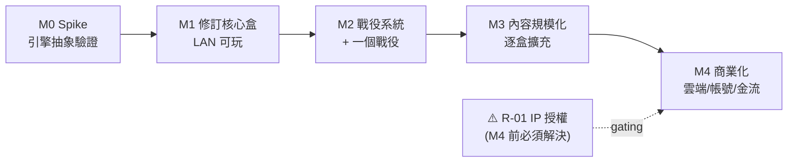

# 04 · 開發路線圖與風險

給 PM / 決策者。重點:**規模的誠實認知**、**分期落地**、**風險(含 IP 授權)**、**待拍板決策**。

---

## 1. 規模的誠實認知(先講清楚)

你選了三個「最大值」:完整規則引擎 + 全部內容 + 商業發行。組合起來的量級是:

> **打造一個 AHLCG 版本的「XMage / Forge」。** 這類專案(MtG 引擎)是**開發 10 年以上、數十位貢獻者累積**的成果。全內容的完整規則引擎,本質是**多人年(multiple person-years)** 的工程,不是幾個月能完成。

這不是勸退,而是要**用對的方式吃下**:
- **架構按「全內容」設計**(通用引擎、資料驅動卡牌、可版本化內容)——這你已經選對方向。
- **實作按「一盒一盒」推進**——從 **Revised Core Set**(修訂核心盒:224 張玩家卡 + 133 張劇本卡、5 位調查員、*Brethren of Ash* 戰役 2 劇本)開始,驗證引擎後,再一盒一盒擴充。**優先鎖定官方「當前(current)環境」**(策展小卡池),把 legacy 全內容列為長期壓力測試(見 [05-rules-engine-spec.md](05-rules-engine-spec.md) §11)。
- **把最高風險前置**:先做時機/效果引擎的 spike,證明抽象撐得住,再投入規模化。
- **內容是長尾**:引擎完成後,新增每張卡是「實作效果 + 寫測試」的重複勞動,可並行、可社群化、可外包。

---

## 2. 分期路線圖(Milestones)

> 時間為**量級參考**(視團隊人數/投入而定),非承諾;假設小型團隊。

### M0 · 技術驗證 Spike 🔬(最關鍵)
**目標:證明核心抽象可行。** 不做 UI 美術、不做帳號。
- 規則引擎骨架:GameState 模型、事件匯流排、能力視窗、效果堆疊、決策請求協定。
- 混沌袋 + 技能檢定 8 步子狀態機(依 [05-rules-engine-spec.md](05-rules-engine-spec.md) §2,seedable RNG)。
- 手工實作 **5~8 張代表性卡**(常駐/反應/改檢定/召敵/多目標選擇 各一)+ 一個**極簡劇本切片**。
- headless 情境測試框架 + CI。
- 兩個 headless 客戶端經 WebSocket 在 LAN 跑完一個回合。
- **產出:可行性結論 + 抽象定案。** 若這關過不了,後面全部要重來——所以先做。
- 量級:數週~2 個月。

### M1 · 修訂核心盒 · LAN 可玩 🎮
**目標:跑通 Brethren of Ash 劇本,LAN 多人,規則自動化,基本 UI。**
- 完成 Revised Core Set 全部玩家卡效果(224 張)+ *Brethren of Ash* 2 劇本(*Spreading Flames*、*Smoke and Mirrors*)+ 混沌袋各難度。
- 完整四階段回合、所有行動、敵人關鍵字、幕/密謀推進、勝負判定。
- 牌組構築器(核心盒卡池)+ 驗證。
- 基本客戶端 UI(JavaFX/LibGDX):地圖、手牌、檯面、檢定、拖放。
- LAN 建房/加入、房內聊天、斷線重連(基本)。
- 對局存檔/續玩(本機)。
- 量級:數月~多月。**這是第一個「真的能玩」的版本。**

### M2 · 戰役系統 + 一個完整戰役 📖
- 戰役日誌、XP 升級、創傷、結局分支、劇本銜接。
- 戰役存檔(先本機/共享檔,抽象化儲存層)。
- 加入第一個循環戰役(如 Dunwich Legacy)驗證跨劇本機制。
- i18n 骨架(先做繁中/英)。

### M3 · 內容規模化 🗂️
- 建立**內容管線與卡牌實作流程**(讓新增卡片標準化、可並行/社群化)。
- 逐盒擴充卡池與戰役;累積自動化測試。
- 客戶端體驗打磨(動畫、音效、卡牌檢視、教學)。

### M4 · 商業化基建 ☁️(需先解決 R-01 授權)
- 帳號、擁有內容(entitlement)、金流、商店。
- 儲存層換雲(PostgreSQL/Redis/CDN)、遊戲伺服器上雲、配對、房編排。
- 遙測、客服、封鎖檢舉、成就。
- 上架平台(Steam/行動商店/自營)。

---

## 3. 風險清單(Risk Register)

| ID | 風險 | 等級 | 說明 | 對策 |
|---|---|---|---|---|
| **R-01** | **IP / 版權授權(商業發行前提)** | 🔴 **致命** | AHLCG 卡牌文字/美術/劇本/商標為 **Fantasy Flight Games / Asmodee** 版權。**未授權的商業發行 = 侵權,無法合法販售,且可能收到停止侵權要求。** | 見下方 §3.1 三條路徑;**商業化(M4)前必須拍板** |
| **R-02** | 規則引擎抽象不足 | 🔴 高 | 時機/效果系統若設計不良,遇刁鑽卡就要重構核心 | **M0 spike 前置驗證**;參考 MtG 引擎既有設計 |
| **R-03** | 全內容工作量無底洞 | 🟠 高 | 數千張卡逐張實作 + 測試,長尾巨大 | 一盒一盒;標準化卡牌實作流程;可社群/外包 |
| **R-04** | 卡牌正確性品質 | 🟠 高 | 規則錯誤會毀掉「完整規則引擎」的賣點 | 每卡情境測試 + CI;公測回報機制 |
| **R-05** | 圖像/文字版權(即使非商業) | 🟠 中 | 卡面美術/文字重製、散布有版權疑慮 | 程式與官方資料分離;圖像不隨源碼散布;授權後才內附 |
| **R-06** | 客戶端體驗門檻 | 🟡 中 | 卡牌遊戲 UX(拖放/動畫/資訊呈現)工作量大 | 引擎解耦 → UI 可獨立迭代/換技術 |
| **R-07** | 商業維運複雜度 | 🟡 中 | 帳號/金流/雲端/客服 | 成熟技術;分期(M4)導入 |

### 3.1 R-01 的三條路徑(必讀)
技術設計與 IP 決策**獨立**——引擎是合法且可複用的資產。你的商業目標有三條路:

1. **取得官方授權(唯一合法商業路徑)**
   - 與 Asmodee / Fantasy Flight 洽談數位改編授權。門檻高、需商務談判,但這是**能合法販售 AHLCG 數位版**的唯一方式。

2. **把引擎當成 IP 中立的技術資產,套用到「自有原創卡牌遊戲」**
   - 你打造的規則引擎、混沌袋、時機系統、連線架構**本身不侵權**。以此引擎做一款**你自己的世界觀/卡牌**的合作卡牌遊戲,可自由商業化。AHLCG 只當「規格參考」與內部測試。

3. **維持非商業 / 個人自用(粉絲專案)**
   - 若放棄商業、僅 LAN 自用或免費社群工具,風險大幅降低(如 OCTGN/TTS 模組的模式:免費、不散布官方美術)。但**仍使用其文字/美術,屬灰色地帶**,且與你選的「商業發行」目標衝突。

> **建議:** 在投入 M4 之前的任何時點,先想清楚走哪條路。**M0–M3 的技術投資在三條路下都不浪費**(引擎、連線、測試都可複用),所以可以先做技術、平行推進 IP 決策。但**不要在未定案前公開散布內含官方卡表/美術的商業版本。**

---

## 4. 待你拍板的決策點(Open Decisions)

| # | 決策 | 選項 / 備註 |
|---|---|---|
| D-1 | **IP 路徑(R-01)** | 官方授權 / 引擎套自有 IP / 非商業。**最優先。** |
| D-2 | 客戶端技術 | JavaFX(桌面快) / LibGDX(跨桌機+手機) / Web / Unity。引擎解耦故可延後,但影響招募。 |
| D-3 | 效果系統偏重 | L1 資料驅動為主 vs L3 腳本為主。建議 L1+L2 主、L3 兜底。 |
| D-4 | 卡牌資料來源 | 自建 vs 參考社群資料結構(ArkhamDB 等,**僅結構參考,版權另計**)。研究結果補充於下。 |
| D-5 | LAN 探索方式 | 手動輸入 IP vs UDP broadcast/mDNS 自動找房。 |
| D-6 | 團隊規模與時程 | 全內容是多人年;先定 M0/M1 的人力與時間盒。 |

---

## 5. 立即可做的下一步(Actionable)

1. **拍板 D-1(IP 路徑)** — 這決定專案性質。
2. **啟動 M0 Spike** — 用 Java 做規則引擎骨架 + 5~8 張代表卡 + LAN 雙客戶端跑一回合。這是把所有風險前置的最快方式。
3. **決定客戶端技術(D-2)** — 影響招募與 M1。
4. 建立 repo 結構:`engine/`(headless Java 引擎)、`server/`、`client/`、`content/`(卡牌資料)、`shared/`(協定)。

---
*風險與路線圖為初版評估,隨 M0 spike 結果修正。IP 決策請優先處理。*
