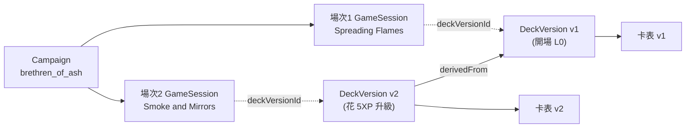

# 08 · 存檔與溯源(Save & Provenance)

> 回答:「玩過的紀錄」怎麼溯源「當時用了哪副牌組(什麼狀態)」;以及這遊戲「存檔」怎麼設計。

## 1. 為什麼不能只存「一副牌」

Arkham 是**戰役制**:一場戰役跨多個劇本,每位調查員的牌組會**隨時間演變**——XP 升級換卡、獲得劇情卡、累積創傷、加入弱點。所以:

- 「Joe 的牌組」不是一個固定物,而是一條**版本歷史**。
- 要溯源「第 2 場用了哪副牌」,必須知道**當時那個版本**,而不是現在的最新版。

**核心原則:不可變版本 + 釘選(immutable versions + pinning)**
1. 牌組每次「定案」(升級/存檔)→ 產生一個**不可變的 `DeckVersion`**(從不覆寫舊版)。
2. 每一筆遊戲紀錄 `GameSession` **釘選**當時各調查員的 `deckVersionId`。
3. 於是溯源 = 直接查:遊戲紀錄 → DeckVersion → 卡表;要看演變 → 沿 `derivedFrom` 往回走。

---

## 2. 三種「存檔」(別混在一起)

| 存檔 | 是什麼 | 何時 |
|---|---|---|
| **戰役存檔 Campaign** | 跨劇本的長期進度:各員**當前牌組版本**、XP、創傷、戰役日誌、下一個劇本 | 劇本之間 |
| **對局存檔 Game save** | 劇本**進行中**的 `GameState` 快照(+ seed + 已發生事件)→ 可續玩/重連 | 劇本中途 |
| **牌組版本 DeckVersion** | 牌組每次定案的**不可變快照** | 每次牌組升級/儲存 |

---

## 3. 資料模型(可持久化)

```jsonc
// 不可變:牌組的某個版本(溯源的關鍵)
DeckVersion {
  id, deckId, investigatorId, campaignId,
  version: 2,
  derivedFromVersionId: "<v1 的 id>",   // ← 往回追溯上一版
  cards: [ { cardCode:"01020", qty:2 }, ... ],
  xpSpent: 5,
  reason: "Spreading Flames 後升級",
  createdAt
}

// 戰役:當前狀態 + 指標(可變的只有「指標」)
Campaign {
  id, campaignDef:"brethren_of_ash", difficulty,
  participants: ["joe_diamond","daniela"],
  currentScenarioIndex: 2,
  status: "in-progress",
  log: [ /* 抉擇、旗標、"remember that…" */ ],
  investigatorState: {
    "joe_diamond": {
      currentDeckVersionId: "<v2>",   // 指到最新版
      xpAvailable: 3,
      trauma: { physical:1, mental:0 },
      storyAssets: [...], weaknesses: [...]
    }
  }
}

// 一場劇本的遊戲紀錄:append-only,永不改寫
GameSession {
  id, campaignId, scenarioId, scenarioIndex,
  startedAt, endedAt,
  participants: [
    { investigatorId:"joe_diamond",
      deckVersionId:"<v2>",          // ★ 這場用的牌組版本(溯源起點)
      startTrauma:{physical:1,mental:0}, startXp:0 }
  ],
  rngSeed: 8837465,                   // 可重播(引擎確定性,見 docs/05)
  eventLog: [ /* 每一步意圖 + 混沌袋抽取… */ ],
  finalStateSnapshot: { /* 存檔:結束或中途的 GameState */ },
  resolution: { outcome:"R2", xpEarned:{joe_diamond:4}, notes:[...] },
  status: "completed"
}
```

> **可變 vs 不可變:** `DeckVersion` 與 `GameSession` **永不改寫**(append-only)→ 溯源可信。只有 `Campaign.investigatorState.currentDeckVersionId` 這種「指標」會更新。

---

## 4. 溯源:給一筆遊戲紀錄,怎麼回推牌組



**查詢步驟(給 `GameSession`):**
1. `session.participants[i].deckVersionId` → `DeckVersion` → **當時的完整卡表**。
2. `DeckVersion.derivedFromVersionId` → 一路往回,**看牌組怎麼一版版演變**(每版花了多少 XP、換了什麼)。
3. `session.rngSeed` + `session.eventLog` → **重播那一整場**(見 §5)。
4. `session.campaignId` + `scenarioIndex` + `Campaign.log` → 那場在戰役中的位置與劇情脈絡。

> 一句話:**遊戲紀錄釘住牌組版本 id,牌組版本鏈住上一版** → 任何一場都能回推「用了哪副牌、那副牌從哪來」。

---

## 5. 重播 = 最強的溯源

規則引擎是**確定性**的(docs/05:集中式 seedable RNG)。因此只要存:
- `rngSeed` + 起始快照(牌組版本、初始狀態)+ **意圖/事件流(eventLog)**

就能**逐步重播整場遊戲、完全重現**(含每一次混沌袋抽取)。這比只存「結果」強太多——可用於:客訴重現、除錯、觀戰、產生戰報。

---

## 6. 存哪裡(呼應 docs/03 §4)

- **共享戰役 / 多人:** 這些一定要 **server 端**(多人共用一場長期戰役,任一人續開;主機本機存檔會遺失/換人讀不到)。
- **不可變記錄(DeckVersion / GameSession / eventLog):** append-only,適合**物件儲存或帶版本的資料表**;永不改寫。
- **可變指標(Campaign 當前版本、xpAvailable):** 一般資料表(PostgreSQL)。
- **對局進行中快照:** 可放 Redis(熱)+ 落地資料庫(冷)。
- 純 LAN 自用:可先本機檔,但**戰役存檔建議儘早共享**(見 docs/03 §4.2)。

---

## 7. 與其他部分的接點

- **牌組編輯器**([`prototype/deckbuilder.html`](../prototype/deckbuilder.html)):每次「儲存」= 產生一個新的 `DeckVersion`;開始劇本時把它釘到 `GameSession`。
- **資料模型:** [`02-design-spec.md §5`](02-design-spec.md);**確定性/重播:** [`05-rules-engine-spec.md`](05-rules-engine-spec.md);**儲存策略:** [`03-tech-requirements.md §4`](03-tech-requirements.md)。
